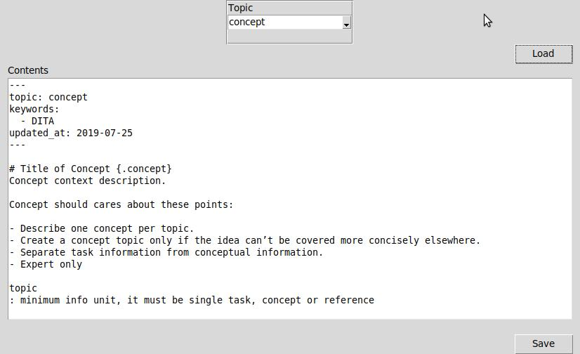

# Ditalime
Ditalime - DITA Entry Support Application

## Quick Start

`python main.py`

If it works properly, the app bring the screen like the following:



## Setup
Prerequisite:

* Python 3.7 (Actually, it works 3.5. I'm not sure under 3.5 also works or not.)
* Tkinter(note: Mac OS default Tkinter has known issue, see [IDLE and tkinter with Tcl/Tk on macOS | Python.org](https://www.python.org/download/mac/tcltk/))

### Library Installation
Install the library with the following command:

```
python -m pip install -r requirements.txt
```

If you add some libraries other than in the requirements.txt, you need to update requirements.txt with the following command:

```
python -m pip freeze > requirements.txt
```

### Library Uninstallation
`python -m pip uninstall "target-library"` will not uninstall dependent libralies.

So, you need to output with `freeze` and `uninstall -r` like the following commands:

```
python -m pip freeze > uninstall.txt
vim uninstall.txt # Remove "target-library" ONLY
python -m pip uninstall -r uninstall.txt
```

### Misc

* Linter for this project is Flake8. If you are VSCode user on Mac, you cat set your linter with `Cmd + Shift + P -> "Python: Select Linter" ->  flake8`.
* Due to lack of the capability of Microsoft' Python Analytics Engine, Pylint will show Warning when you use the local module. For handling this warning, you need to change your checker with `Settings > Search "Jedi" > Tick "Python Jedi Enabled"`.
